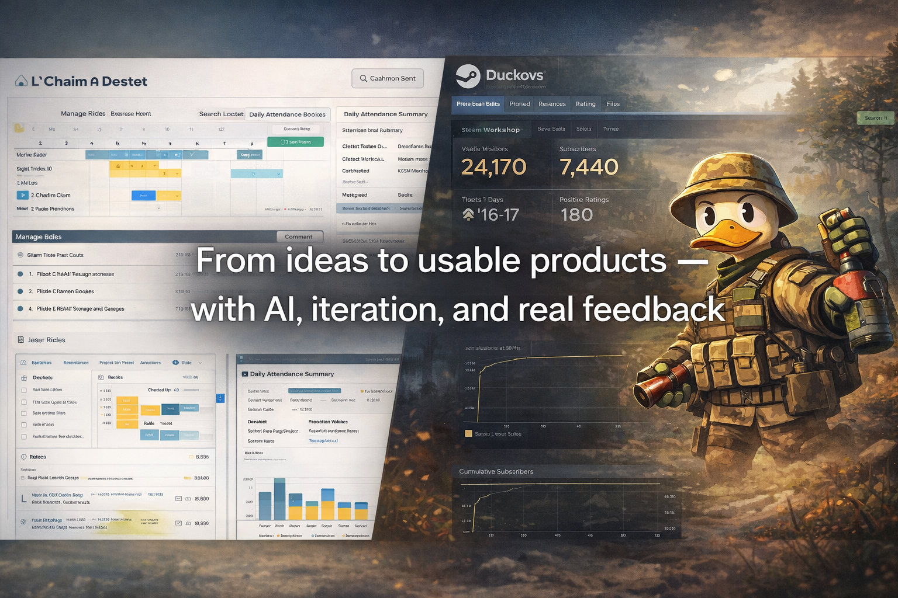

  

# Hi, I'm Leo 👋

CS graduate based in Richmond, BC.  
I build practical web systems, product-style side projects, and user-focused technical solutions.

**Open to junior roles in Software Development, QA, and IT Support.**

  <a href="https://www.linkedin.com/in/yanghuijing-wang-01459b291/">LinkedIn</a> •
  <a href="mailto:your-email@example.com">Email</a> •
  <a href="https://github.com/9OwO6/DuckovMod">DuckovMod</a>

---

## Featured Projects

<table>
  <tr>
    <td width="50%" valign="top">
      
       
      <b>DuckovMod</b> 
      Gameplay quality-of-life mod focused on throwable workflow, hotkey switching, and real player feedback.
    </td>
    <td width="50%" valign="top">
      
       
      <b>L’Chaim Attendance System</b> 
      Full-stack attendance and scheduling platform built for a real client environment.
    </td>
  </tr>
  <tr>
    <td width="50%" valign="top">
      
       
      <b>Happy Beans Shop</b> 
      Full-stack web project focused on practical product delivery and UI implementation.
    </td>
  </tr>
</table>

---

## Tech Stack

---

## What I Work On

- Full-stack web systems
- Debugging, testing, and workflow improvement
- Product-style side projects with real use cases
- Practical technical support and problem solving

---

## Contact

- LinkedIn: https://www.linkedin.com/in/yanghuijing-wang-01459b291/
- GitHub: https://github.com/9OwO6
- Location: Richmond, BC, Canada
