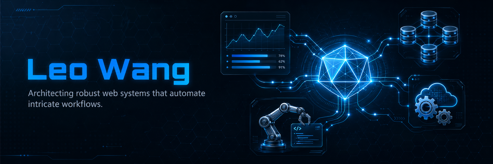

  

# Hi, I'm Leo 👋

CS graduate based in Richmond, BC. I build practical web systems, automation tools, and product-style projects focused on real workflows, clean interfaces, and operational reliability.

**Open to Junior Full-Stack Developer, QA Analyst, IT Support, and Data / Operations Analyst roles.**

  <a href="https://www.linkedin.com/in/yanghuijing-wang-01459b291/">LinkedIn</a> •
  <a href="https://github.com/9OwO6">GitHub</a> •
  <a href="https://github.com/9OwO6/lchaim-attendance-system-showcase">L'Chaim Showcase</a> •
  <a href="https://github.com/9OwO6/DuckovMod">DuckovMod</a>

---

## Featured Projects

<table>
  <tr>
    <td width="50%" valign="top">
      
       
      <b>L'Chaim Attendance System</b> 
      Full-stack attendance, booking, and reporting platform built around a real senior day centre workflow. 
       
      <b>Stack:</b> Next.js, TypeScript, Supabase, PostgreSQL, NextAuth.js, Tailwind CSS
    </td>
    <td width="50%" valign="top">
      
       
      <b>DuckovMod</b> 
      C# gameplay quality-of-life mod focused on throwable management, hotkey workflows, and user-driven iteration. 
       
      <b>Stack:</b> C#, .NET, Unity-style modding workflow, debugging
    </td>
  </tr>
  <tr>
    <td width="50%" valign="top">
      <a href="https://github.com/9OwO6/nonggengji-restaurant-website">
        <b>Nonggengji English Website</b>
      </a>
       
      English-facing restaurant website designed for Western diners, including menu structure, dish presentation, and responsive UI delivery. 
       
      <b>Stack:</b> Next.js, React, TypeScript, Tailwind CSS, Vercel
    </td>
    <td width="50%" valign="top">
      
       
      <b>Happy Beans Shop</b> 
      Boutique shop web project focused on product display, small-business web presence, and practical UI implementation. 
       
      <b>Stack:</b> React / web UI, product-focused frontend delivery
    </td>
  </tr>
</table>

---

## Tech Stack

**Frontend:** Next.js, React, TypeScript, Tailwind CSS  
**Backend / Data:** Next.js API routes, Spring Boot, PostgreSQL, Supabase, Prisma  
**Tools:** Git, GitHub, Vercel, Docker, Cursor, Figma  
**Also:** Python, Java, C#, QA / debugging workflows, technical support mindset

---

## What I Bring

- Real project delivery experience beyond tutorial projects
- Ability to translate messy manual workflows into practical web systems
- Strong debugging, testing, and user-feedback iteration mindset
- Bilingual communication in English and Mandarin
- Comfortable using AI tools responsibly to accelerate development while keeping architecture and delivery decisions grounded

---

## Current Focus

- Strengthening full-stack, QA, SQL, and IT support fundamentals
- Improving portfolio projects into recruiter-friendly case studies
- Building practical tools that solve real workflow problems

---

## Contact

- LinkedIn: https://www.linkedin.com/in/yanghuijing-wang-01459b291/
- GitHub: https://github.com/9OwO6
- Location: Richmond, BC, Canada
